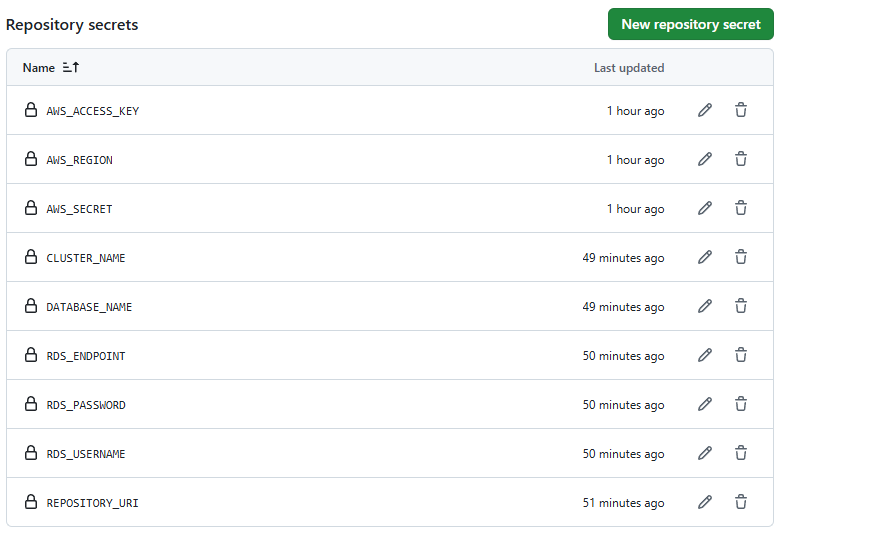
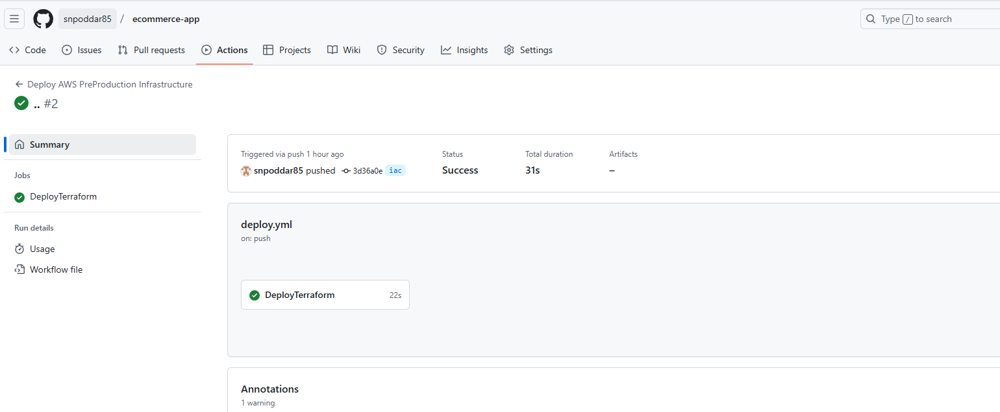
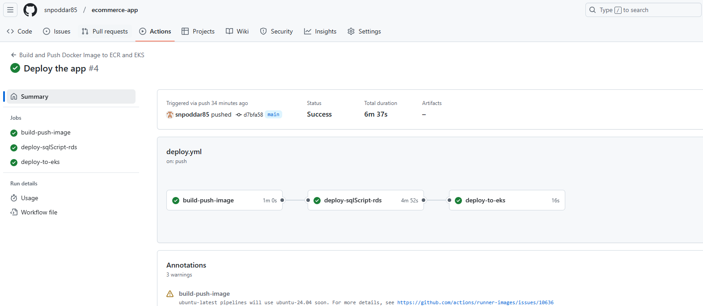
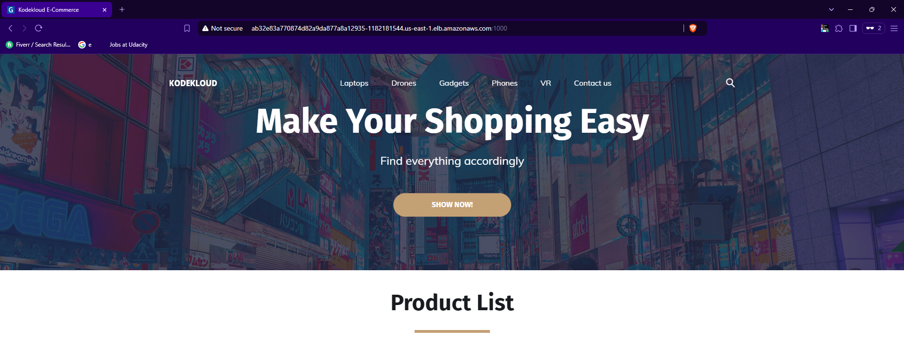

# Deploy Ecommerce PHP APP on AWS

## 🌟 Objective
🎯 Master the use of Terraform for deploying infrastructure on AWS ☁️, integrate it seamlessly with GitHub Workflows 🤖, and manage deployments efficiently using Kubernetes 🚀.

## 🔄 What is the Process for Deployment?

🌿 Branch Structure:\
1️⃣ Main Branch: Used to deploy the PHP application on the EKS cluster.

2️⃣ IAC Branch: Dedicated to deploying Terraform scripts for infrastructure provisioning.


## 🚀 Let's explain how to deploy and explain the workflow for each branch

### Main Branch

🛠️ Build and Push Docker Image to ECR and EKS

1.	📌 Trigger:

o	The workflow runs when there’s a push to the main branch.

2.	🏗️ Job: Build and Push Docker Image

o	🖇️ Checkout Code: The code from the repository is pulled.

o	🔐 Log in to Amazon ECR: Login credentials to Amazon Elastic Container Registry are set up using gh-ecr-login.

o	🐳 Build and Push Docker Image:

	The Docker image is built with the repository as the context.

	It is pushed to ECR with tags (latest and commit SHA).
________________________________________
📊 Deploy SQL Script to RDS

1.🏗️ Job: deploy-sqlScript-rds (depends on Docker image build):

o	💾 Install MySQL Client: The MySQL client is set up for deployment tasks.

o	🖇️ Checkout Code: Pulls the code for the database script.

o	📦 Cache Deployment Flag:
	Uses a flag file (deployment-flag.txt) to check if the deployment has already been performed.

o	🟢 Check Deployment Status:

	If not deployed:

	Runs the SQL script (db-load-script.sql) against the RDS database using MySQL.

	Creates a flag to mark the deployment as done.

	If deployed:

	Skips the deployment process.
________________________________________
☸️ Deploy to EKS Cluster

1.🏗️ Job: deploy-to-eks (depends on RDS SQL deployment):

o	🔐 Configure AWS Credentials: AWS credentials are set up for interaction with the EKS cluster.

o	📡 Update kubeconfig: Updates the kubeconfig file to connect to the specified EKS cluster.

o	🔧 Install kubectl: Ensures kubectl is installed for managing Kubernetes resources.

o	🖇️ Checkout Code: Pulls the Kubernetes manifests.

o	📦 Deploy Kubernetes Manifests:

	Checks if the php namespace exists. If not, it creates one.

	Applies the Kubernetes manifests located in the kube-manifests directory.

	Displays the services deployed in the php namespace.
________________________________________
🚀 Full Workflow Flow
1.	🏗️ Build and Push Docker Image:
o	Builds and pushes Docker images to ECR.
2.	📊 Deploy SQL Script:
o	Sets up MySQL client, executes SQL scripts on RDS, and avoids duplicate deployments.
3.	☸️ Deploy to EKS:
o	Deploys application Kubernetes manifests to the EKS cluster.
________________________________________
This workflow ensures a CI/CD pipeline for deploying a PHP application with AWS (ECR, RDS, EKS) integration! 🐳☸️💾

### IAC Branch

🌍 Deploy AWS PreProduction Infrastructure

•	📌 Trigger: Runs on push to the iac branch.

•	🔐 AWS Credentials: Configured for Terraform to interact with AWS.

•	🛠️ Terraform Steps:

1.	🖌️ Format: Ensures consistent code style.

2.	🤖 Init: Prepares backend and modules.

3.	📋 Validate: Checks configuration for syntax errors.

4.	📖 Plan: Generates and evaluates infrastructure changes.

5.	⚙️ Apply: Deploys changes if necessary.

•	💬 PR Comments: Posts Terraform results (fmt, validate, plan) on pull requests.
This workflow automates AWS infrastructure provisioning with Terraform and clear reporting. 🚀

##
#  🚀 How to deploy ?

## 🔐 Setup Secrets in GitHub

To use this workflow, you first need to configure your GitHub repository secrets as shown in the provided screenshot. These secrets include sensitive data like AWS credentials, repository URIs, and environment-specific variables required for deployment.

Navigate to Settings > Secrets and variables > Actions in your GitHub repository to add the necessary secrets. 🚀




##  🚀 Deploy Pipelines Across Multiple Branches: IAC First, Then Main





#
## 🌍 Deploy Terraform Locally
### 🛠️ Steps to Execute:

```
terraform init
terraform plan
terraform apply --auto-approve
```

##
## to browse the app do the following 

```
kubectl get svc -n php
```




